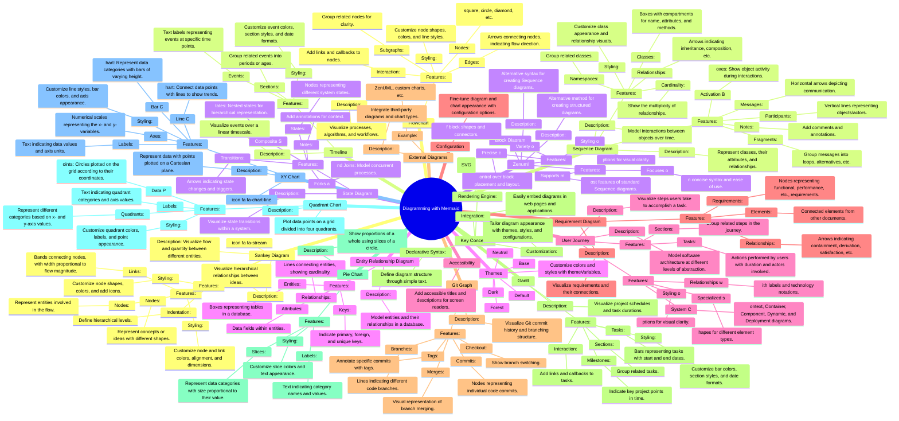

```mermaid
mindmap
    ((Diagramming with Mermaid))

        Flowchart

            Description: 
                Visualize processes, algorithms, and workflows.
            Features:
                Nodes: 
                    Shapes representing steps (square, circle, diamond, etc.)
                Edges: 
                    Arrows connecting nodes, indicating flow direction.
                Subgraphs: 
                    Group related nodes for clarity.
                Styling: 
                    Customize node shapes, colors, and line styles.
                Interaction: 
                    Add links and callbacks to nodes.
        Sequence Diagram
            Description: 
                Model interactions between objects over time.
            Features:
                Participants: 
                    Vertical lines representing objects/actors.
                Messages: 
                    Horizontal arrows depicting communication.
                Activation B
                    oxes: Show object activity during interactions.
                Fragments: 
                    Group messages into loops, alternatives, etc.
                Notes: 
                    Add comments and annotations.
            Description: 
                Represent classes, their attributes, and relationships.
            Features:
                Classes: 
                    Boxes with compartments for name, attributes, and methods.
                Relationships: 
                    Arrows indicating inheritance, composition, etc.
                Cardinality: 
                    Show the multiplicity of relationships.
                Namespaces: 
                    Group related classes.
                Styling: 
                    Customize class appearance and relationship visuals.
        State Diagram
            Description: 
                Visualize state transitions within a system.
            Features:
                States: 
                    Nodes representing different system states.
                Transitions: 
                    Arrows indicating state changes and triggers.
                Composite S
                    tates: Nested states for hierarchical representation.
                Forks a
                    nd Joins: Model concurrent processes.
                Notes: 
                    Add annotations for context.
        Entity Relationship Diagram
            Description: 
                Model entities and their relationships in a database.
            Features:
                Entities: 
                    Boxes representing tables in a database.
                Relationships: 
                    Lines connecting entities, showing cardinality.
                Attributes: 
                    Data fields within entities.
                Keys: 
                    Indicate primary, foreign, and unique keys.
        User Journey
            Description: 
                Visualize steps users take to accomplish a task.
            Features:
                Sections: 
                    Group related steps in the journey.
                Tasks: 
                    Actions performed by users with duration and actors involved.
            Description: 
                Model software architecture at different levels of abstraction.
            Features:
                System C
                    ontext, Container, Component, Dynamic, and Deployment diagrams.
                Specialized s
                    hapes for different element types.
                Relationships w
                    ith labels and technology notations.
                Styling o
                    ptions for visual clarity.
        Requirement Diagram
    
            Description: 
                Visualize requirements and their connections.
            Features:
                Requirements: 
                    Nodes representing functional, performance, etc., requirements.
                Elements: 
                    Connected elements from other documents.
                Relationships: 
                    Arrows indicating containment, derivation, satisfaction, etc.
        Git Graph
            Description: 
                Visualize Git commit history and branching structure.
            Features:
                Commits: 
                    Nodes representing individual code commits.
                Branches: 
                    Lines indicating different code branches.
                Merges: 
                    Visual representation of branch merging.
                Checkout: 
                    Show branch switching.
                Tags: 
                    Annotate specific commits with tags.
        Gantt

            Description: 
                Visualize project schedules and task durations.
            Features:
                Tasks: 
                    Bars representing tasks with start and end dates.
                Sections: 
                    Group related tasks.
                Milestones: 
                    Indicate key project points in time.
                Styling: 
                    Customize bar colors, section styles, and date formats.
                Interaction: 
                    Add links and callbacks to tasks.
        Pie Chart
            
            Description: 
                Show proportions of a whole using slices of a circle.
            Features:
                Slices: 
                    Represent data categories with size proportional to their value.
                Labels: 
                    Text indicating category names and values.
                Styling: 
                    Customize slice colors and text appearance.
        Quadrant Chart
      
            Description: 
            Plot data points on a grid divided into four quadrants.
            Features:
                Quadrants: 
                    Represent different categories based on x- and y-axis values.
                Data P
                    oints: Circles plotted on the grid according to their coordinates.
                Labels: 
                    Text indicating quadrant categories and axis values.
                Styling: 
                    Customize quadrant colors, labels, and point appearance.
        XY Chart
            icon fa fa-chart-line
            Description: 
                Represent data with points plotted on a Cartesian plane.
            Features:
                Line C
                    hart: Connect data points with lines to show trends.
                Bar C
                    hart: Represent data categories with bars of varying height.
                Axes: 
                    Numerical scales representing the x- and y-variables.
                Labels: 
                    Text indicating data values and axis units.
                Styling: 
                    Customize line styles, bar colors, and axis appearance.
        Sankey Diagram
            icon fa fa-stream
            Description: Visualize flow and quantity between different entities.
            Features:
                Nodes: 
                    Represent entities involved in the flow.
                Links: 
                    Bands connecting nodes, with width proportional to flow magnitude.
                Styling: 
                    Customize node and link colors, alignment, and dimensions.

            Description: 
                Visualize hierarchical relationships between ideas.
            Features:
                Nodes: 
                    Represent concepts or ideas with different shapes.
                Indentation: 
                    Define hierarchical levels.
                Styling: 
                    Customize node shapes, colors, and add icons.
        Timeline
            Description: 
                Visualize events over a linear timescale.
            Features:
                Events: 
                    Text labels representing events at specific time points.
                Sections: 
                    Group related events into periods or ages.
                Styling: 
                    Customize event colors, section styles, and date formats.
        Zenuml
            Description: 
                Alternative syntax for creating Sequence diagrams.
            Features:
                Focuses o
                    n concise syntax and ease of use.
                Supports m
                    ost features of standard Sequence diagrams.
            Block Diagram
   
            Description: 
                Alternative method for creating structured diagrams.
            Features:
                Precise c
                    ontrol over block placement and layout.
                Variety o
                    f block shapes and connectors.
                Styling o
                    ptions for visual clarity.


        Themes
            Default
            Neutral 
            Dark 
            Forest 
            Base
            Customize colors and styles with themeVariables.
        Accessibility
            Add accessible titles and descriptions for screen readers.
        Configuration
            Fine-tune diagram and chart appearance with configuration options.

        External Diagrams

            Description: 
                    Integrate third-party diagrams and chart types.
            Example: 
                ZenUML, custom charts, etc.

        Key Concepts
            Declarative Syntax: 
                Define diagram structure through simple text.
            Rendering Engine: 
                Translates text into visual representations (SVG)
            Customization: 
                Tailor diagram appearance with themes, styles, and configurations.
            Integration: 
                Easily embed diagrams in web pages and applications.

```
